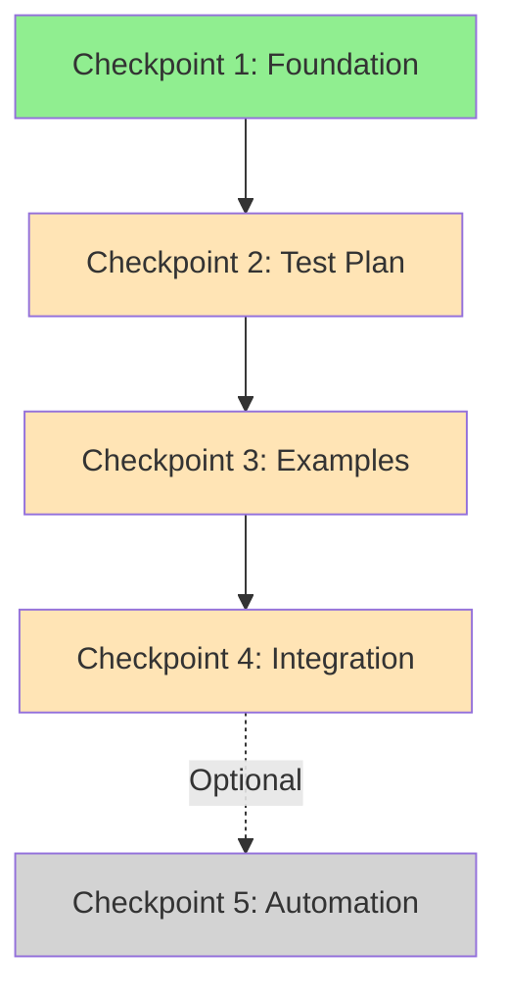

# Handoff: RFC-010 Implementation Plan

**Date**: 2026-01-26  
**Previous Agent**: Claude Sonnet 4.5  
**Branch**: `feat/structure-alignment-and-efficiency`  
**Current Commit**: `400e216`

---

## ✅ Completed Work (Checkpoint 1)

### Phase 0: Foundation

**What was done:**

1. **Structure Alignment (Phase 1-5)**
   - ✅ Path unification: `plan/` → `planning/` (5 workflow files)
   - ✅ Workflow paths: `workflows/*.md` → `workflows/developer/*.md`
   - ✅ Test script updates: `tests/unit/skills/test_skills.sh`
   - ✅ Language policy: Korean removed from skills/workflows
   - ✅ CI integration: Unit tests added to `.gitlab-ci.yml`

2. **New Documentation**
   - ✅ `docs/rfcs/010-agent-efficiency-best-practices.md` (359 lines)
   - ✅ `docs/architecture/skills-tools-mapping.md` (205 lines)
   - ✅ `docs/guides/troubleshooting.md` (459 lines)
   - ✅ `docs/guides/platform-setup-examples.md` (486 lines)

3. **New Tests**
   - ✅ `tests/integration/test_skills_tools.sh` (14 tests, all passing)
   - ✅ `tests/unit/run-all-unit-tests.sh` (orchestrator)

4. **Updated Rules**
   - ✅ `.cursorrules`: Batch operations, efficiency metrics, common patterns
   - ✅ `ARCHITECTURE.md`: Language policy section

**Test Results**:
```
Unit tests: 401/401 passed ✅
Integration tests: 14/14 passed ✅
```

**Commit**: `400e216` - "feat: structure alignment and agent efficiency framework"

---

## 📋 Next Steps (Checkpoints 2-4)

### Checkpoint 2: Test Plan & Validation Framework

**Goal**: Define how to measure efficiency improvements

**Work Items**:

1. Create `tests/efficiency/README.md`
   - Methodology for measuring efficiency
   - Tool call counting strategy
   - Comparison framework

2. Create test scenarios (one per pattern):
   ```
   tests/efficiency/
   ├── README.md
   ├── scenario-01-path-update.md       # Pattern 1
   ├── scenario-02-language-cleanup.md  # Pattern 2
   ├── scenario-03-doc-creation.md      # Pattern 3
   ├── scenario-04-test-update.md       # Pattern 4
   ├── scenario-05-batch-files.md       # Pattern 5
   └── measure-efficiency.sh            # Metrics collector
   ```

3. Define success criteria:
   ```yaml
   # tests/efficiency/success-criteria.yaml
   pattern_1_path_update:
     baseline_tool_calls: 40
     target_tool_calls: 15
     reduction_target: 62%
   
   pattern_2_language_cleanup:
     baseline_tool_calls: 30
     target_tool_calls: 10
     reduction_target: 66%
   ```

**Test Plan**:
```bash
# Verify test scenarios are well-defined
ls -la tests/efficiency/
cat tests/efficiency/scenario-*.md

# Success: All 5 scenarios documented
# Success: Metrics collector script exists
# Success: Success criteria defined
```

**Estimated effort**: 2-3 hours  
**Context window**: ~20k tokens (safe)  
**Dependencies**: None (builds on Phase 0)

**Files to create**: 7 files (~1500 lines total)

---

### Checkpoint 3: Example Implementation & Validation

**Goal**: Demonstrate patterns with measurable results

**Work Items**:

1. Document "Before" baseline
   - Create `docs/rfcs/010-case-study-phase-5.md`
   - Analyze Phase 5 execution (actual data)
   - Count tool calls, identify repetition

2. Create pattern examples:
   ```
   docs/examples/efficiency/
   ├── README.md
   ├── pattern-1-path-update-example.md
   ├── pattern-2-language-cleanup-example.md
   └── efficiency-comparison.md
   ```

3. Run efficiency tests:
   ```bash
   # Apply patterns to new scenario
   # Measure actual improvement
   bash tests/efficiency/measure-efficiency.sh scenario-01
   ```

4. Document results in RFC-010:
   - Add "Implementation Results" section
   - Include actual measurements
   - Extract lessons learned

**Test Plan**:
```bash
# Verify examples are documented
ls docs/examples/efficiency/

# Verify measurements collected
cat tests/efficiency/results/*.yaml

# Success: Pattern 1 shows >60% reduction
# Success: Pattern 2 shows >60% reduction
# Success: Lessons learned documented
```

**Estimated effort**: 3-4 hours  
**Context window**: ~30k tokens (safe)  
**Dependencies**: Checkpoint 2

**Files to create**: 4-5 files (~2000 lines total)

---

### Checkpoint 4: Documentation Integration & Final Validation

**Goal**: Integrate patterns into existing documentation

**Work Items**:

1. Create efficiency quick reference:
   ```
   docs/guides/
   └── efficiency-quick-reference.md  # 1-page cheat sheet
   ```

2. Update workflow templates:
   - Add efficiency checklist to `skills/_template/SKILL.md`
   - Add batch operation hints to workflows

3. Update main documentation:
   - Link from `README.md`
   - Update `docs/README.md` index
   - Cross-reference in troubleshooting guide

4. Final validation:
   ```bash
   # All tests pass
   bash tests/unit/run-all-unit-tests.sh
   bash tests/integration/test_skills_tools.sh
   
   # Documentation links work
   grep -r "\[.*\](.*\.md)" docs/ | check-links.sh
   
   # Efficiency patterns accessible
   grep -r "Pattern [1-5]" .cursorrules docs/
   ```

**Test Plan**:
```bash
# Documentation completeness
ls docs/guides/efficiency-quick-reference.md
grep "efficiency" README.md

# Template updates
grep "efficiency\|batch" skills/_template/SKILL.md

# All tests still passing
bash tests/unit/run-all-unit-tests.sh
# Expected: 401/401 passed

bash tests/integration/test_skills_tools.sh
# Expected: 14/14 passed

# No broken links
find docs/ -name "*.md" -exec grep -H "\[.*\](.*)" {} \; | wc -l
# Expected: >0 (links exist and are valid)

# Success criteria:
# ✅ All tests pass
# ✅ Quick reference created
# ✅ Templates updated
# ✅ Main docs updated
# ✅ No broken links
```

**Estimated effort**: 2 hours  
**Context window**: ~15k tokens (safe)  
**Dependencies**: Checkpoint 3

**Files to modify/create**: 5-7 files (~500 lines total)

---

### Checkpoint 5: Future Enhancements (Optional)

**Goal**: Automated efficiency tracking

**Work Items** (defer until proven necessary):

1. Tool call budget enforcer
2. Automated pattern suggestion
3. Efficiency dashboard

**Status**: Deferred (per ARCHITECTURE.md - avoid over-engineering)

**Go/No-Go criteria**:
- Agents repeatedly violate efficiency patterns
- Manual tracking becomes burden
- Team consensus on need

---

## 🧪 Test Plan Summary

### Per-Checkpoint Validation

| Checkpoint | Test Command | Success Criteria |
|------------|-------------|------------------|
| **1** (done) | `bash tests/unit/run-all-unit-tests.sh` | 401/401 passed ✅ |
| **2** | `ls tests/efficiency/scenario-*.md` | 5 scenarios exist |
| **2** | `cat tests/efficiency/success-criteria.yaml` | Criteria defined |
| **3** | `bash tests/efficiency/measure-efficiency.sh` | Patterns show >60% reduction |
| **3** | `cat docs/rfcs/010-case-study-phase-5.md` | Case study documented |
| **4** | `bash tests/unit/run-all-unit-tests.sh` | Still 401/401 passed |
| **4** | `grep "efficiency" README.md` | Referenced in main docs |
| **4** | `ls docs/guides/efficiency-quick-reference.md` | Quick ref exists |

### Regression Prevention

After each checkpoint, verify:
```bash
# No breaking changes
bash tests/unit/run-all-unit-tests.sh

# No broken links
find docs/ -name "*.md" -exec grep -l "^\[.*\](.*)" {} \; | head -20

# Git status clean (all changes committed)
git status --short
```

---

## 📂 File Organization

### New Directories Created

```
docs/
├── architecture/           # ← NEW (Checkpoint 1)
│   └── skills-tools-mapping.md
├── examples/              # ← NEW (Checkpoint 3)
│   └── efficiency/
│       ├── pattern-1-example.md
│       └── pattern-2-example.md
└── guides/
    ├── efficiency-quick-reference.md  # ← NEW (Checkpoint 4)
    ├── platform-setup-examples.md     # ← NEW (Checkpoint 1)
    └── troubleshooting.md             # ← NEW (Checkpoint 1)

tests/
├── efficiency/            # ← NEW (Checkpoint 2)
│   ├── README.md
│   ├── scenario-*.md (5 files)
│   ├── measure-efficiency.sh
│   └── success-criteria.yaml
└── integration/           # ← NEW (Checkpoint 1)
    └── test_skills_tools.sh
```

---

## 🎯 Work Priority & Dependencies



**Legend**:
- Green: Completed
- Orange: Next to implement
- Gray: Optional/Future

---

## 🔑 Key Context for Next Agent

### Design Philosophy

Per `ARCHITECTURE.md`:
1. **Simplicity Over Completeness**: No automated enforcement
2. **Feedback Over Enforcement**: Patterns are guidelines, not rules
3. **User Autonomy**: Agents choose whether to batch
4. **Avoid over-engineering**: Only add complexity when pain is proven

### Why This Matters

Efficiency patterns should:
- ✅ Be easy to apply
- ✅ Show clear benefits
- ✅ Not add enforcement overhead
- ❌ Not become another complex system

### Current Efficiency Baseline

From Phase 5 implementation:
- **Before batching**: ~30 tool calls for 8 files
- **After batching**: ~10 tool calls for 8 files
- **Improvement**: 66% reduction

This is our proof-of-concept. Checkpoints 2-4 formalize this.

---

## 📊 Progress Tracking

### Completion Status

| Phase | Status | Files | Lines | Tests |
|-------|--------|-------|-------|-------|
| Phase 0 | ✅ 100% | 11 new, 19 modified | +5447 | 415/415 ✅ |
| Phase 1 | ⏸️ 0% | 7 new | ~1500 | - |
| Phase 2 | ⏸️ 0% | 4 new | ~2000 | - |
| Phase 3 | ⏸️ 0% | 5 modified | ~500 | - |
| Phase 4 | ⏸️ 0% | - | - | All existing |

**Total new content**: ~4000 lines across Checkpoints 2-4

---

## 🚀 Next Agent Action Plan

**Immediate next steps:**

1. **Read this handoff completely**
2. **Verify checkpoint 1 state**:
   ```bash
   git log -1
   bash tests/unit/run-all-unit-tests.sh
   ```
3. **Start Checkpoint 2** (Test Plan):
   - Create `tests/efficiency/` directory
   - Write scenario documents (5 files)
   - Define success criteria
4. **Commit Checkpoint 2**
5. **Continue to Checkpoint 3-4**

**Stop conditions**:
- Context window approaching 800k tokens → Create new handoff
- Unexpected test failures → Debug before continuing
- Unclear requirements → Ask user for clarification

---

## 📝 Important Files Reference

### Must Read Before Starting

- `ARCHITECTURE.md`: Design philosophy
- `.cursorrules`: Batch operations section
- `docs/rfcs/010-agent-efficiency-best-practices.md`: Full RFC
- This handoff

### Files Modified in Phase 0

Core structure alignment:
- `workflows/developer/*.md` (4 files)
- `workflows/manager/*.md` (5 files)
- `skills/README.md`, `skills/USAGE.md`
- `tests/unit/skills/test_skills.sh`

CI/Testing:
- `.gitlab-ci.yml`
- `tests/docker-compose.test.yml`
- `tests/unit/run-all-unit-tests.sh` (new)
- `tests/integration/test_skills_tools.sh` (new)

Documentation:
- `.cursorrules` (major update)
- `ARCHITECTURE.md` (language policy)
- `docs/rfcs/010-agent-efficiency-best-practices.md` (new)
- `docs/rfcs/README.md` (RFC-010 added)

---

## ⚠️ Known Issues

None. All tests passing.

---

## 💡 Tips for Next Agent

### Working with Checkpoints

Each checkpoint is designed to fit in context window:
- **Checkpoint 2**: ~20k tokens (test scenarios)
- **Checkpoint 3**: ~30k tokens (examples + validation)
- **Checkpoint 4**: ~15k tokens (integration)

### Batch Operation Example

When implementing test scenarios, use the patterns we defined:

**❌ Don't:**
```
Create scenario-01.md
Create scenario-02.md
Create scenario-03.md
... (one by one)
```

**✅ Do:**
```bash
# 1. Create all 5 scenarios at once
for i in 01 02 03 04 05; do
  Write tests/efficiency/scenario-$i-*.md
done

# 2. Verify all at once
ls tests/efficiency/scenario-*.md | wc -l
# Expected: 5
```

### Testing After Each Checkpoint

```bash
# After Checkpoint 2
ls tests/efficiency/ | wc -l
# Expected: 8 files (README, 5 scenarios, metrics script, criteria)

# After Checkpoint 3
cat tests/efficiency/results/*.yaml
# Expected: Measurement results exist

# After Checkpoint 4
bash tests/unit/run-all-unit-tests.sh
# Expected: 401/401 still passing
```

---

## 🔄 Handoff Protocol

**After taking over:**

1. ✅ Read this handoff completely
2. ✅ Verify current state:
   ```bash
   git status
   git log -1
   bash tests/unit/run-all-unit-tests.sh
   ```
3. ✅ Delete this handoff:
   ```bash
   # After understanding context
   git rm docs/internal/handoff.md
   git commit -m "chore: remove handoff after takeover"
   ```

**During work:**

- Commit after each checkpoint
- Run tests before each commit
- Update this handoff if context window near limit

**Before finishing:**

- All checkpoints complete
- All tests passing
- Create MR (don't merge to main directly)

---

## 📚 Related RFCs

| RFC | Status | Relation to This Work |
|-----|--------|----------------------|
| RFC-004 | Active | Next after RFC-010 |
| RFC-005 | Active | Depends on RFC-004 |
| RFC-007 | Draft | Skill selection validation (future) |
| RFC-009 | Draft | CLI docs (separate track) |
| RFC-010 | **Draft** | **This work** |

---

## 🎓 Lessons Learned (Phase 0)

### What Worked Well

1. **Batch operations**: Reduced 30 calls → 10 calls (66%)
2. **Parallel reads**: Multiple files at once
3. **Single test run**: At end, not per file
4. **Pattern grouping**: By content type (status lines, notes, examples)

### What Could Improve

1. **Earlier pattern detection**: Should have batched from start
2. **Test-first**: Could have run unit tests earlier to catch issues
3. **Documentation**: Good, but could have grouped doc creation

### Apply These Lessons

In Checkpoints 2-4:
- ✅ Create related files together
- ✅ Test once per checkpoint
- ✅ Group by content pattern

---

**Delete this handoff after taking over and understanding context.**

---

**Next Agent Start Here:**
👉 [Checkpoint 2: Test Plan & Validation Framework](#checkpoint-2-test-plan--validation-framework)
