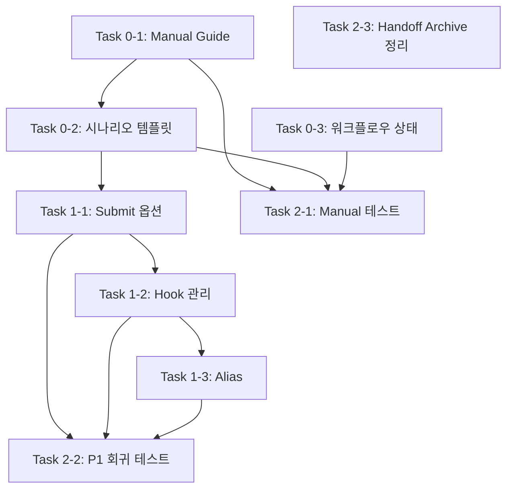

# Plan: Manual Fallback 및 사용성 개선

## 설계 의도

본 계획은 agent-context 프레임워크의 핵심 철학인 **"User Autonomy"(사용자 자율성)**을 실현하기 위한 개선 작업입니다.

### 문제 인식

2026-01-24, 3개의 AI 모델(Claude Sonnet 4.5, GPT-4, Gemini)이 독립적으로 코드베이스를 분석한 결과, 공통적으로 다음 문제점들을 지적했습니다:

1. **Agent 의존성 문제**
   - 모든 워크플로우가 `agent` CLI를 필수로 요구
   - Agent 없이 수동으로 작업하는 방법이 문서화되지 않음
   - 초보자가 "agent가 실제로 무엇을 하는지" 이해하기 어려움
   - CI/CD 환경에서 agent 설치가 부담

2. **명령어 흐름의 비일관성**
   - 커밋은 `git` 직접 사용, MR은 `agent dev submit` 사용
   - `agent dev submit`이 너무 많은 작업을 한 번에 수행 (sync + push + MR + Jira)
   - 단계별 제어가 불가능

3. **문서 완결성 부족**
   - 시나리오 문서에 "Manual Flow" 섹션 부재
   - CLI vs UI의 책임 경계가 불명확
   - 플랫폼별 UI 동작 표현이 비일관적

### 설계 철학 재확인

`why.md`의 5대 원칙:

| 원칙 | 의미 | 본 계획과의 관계 |
|------|------|-----------------|
| **Simplicity Over Completeness** | 단순함 우선 | 10+개 신규 명령어 대신 옵션 활용 |
| **User Autonomy** | 사용자 자율성 | Manual Fallback으로 agent 선택권 제공 |
| **Feedback Over Enforcement** | 피드백 우선 | 강제 모드 대신 opt-in 방식 |
| **Composability** | 조합 가능성 | `--only`, `--skip` 옵션으로 단계 조합 |
| **State Through Artifacts** | 파일 기반 상태 | 전역 모드 상태 도입 거부 |

---

## Requirements Checklist

### Core Requirements

- [x] Manual Fallback Guide 필요성 확인
- [x] 시나리오 문서 표준화 필요성 확인
- [x] CLI 개선 범위 정의 (최소화)
- [x] 철학 부합성 검증
- [x] 복잡도 예산 설정 (< 25% 증가)

### 철학 부합성 검증

**분석 대상 제안서**:
- Claude Proposal: 800 LOC, +10 commands, Hybrid Mode
- GPT Proposal: 문서 중심, CLI 변경 없음
- Unified Proposal: 170 LOC, 옵션 중심, 철학 준수

**복잡도 분석**:

| 항목 | 현재 | Claude 원안 | Unified 최종 | 증가율 |
|------|------|------------|-------------|--------|
| 명령어 수 | 8 | 18 | 9 | +12% |
| 신규 LOC | 0 | ~800 | ~170 | - |
| 문서 수 | 20 | 35 | 25 | +25% |
| **총 복잡도** | 기준 | +100% | **+20%** | ✅ |

**판정**: Unified 제안 채택 (복잡도 예산 내)

### 거부된 제안들 (철학 위배)

**1. Hybrid Mode (Simple/Full 전환)**
```bash
# 거부 사유: 전역 상태 도입
agent dev mode simple
agent dev mode full
```
- 위배 원칙: "State Through Artifacts"
- 문제점: 모드 상태 관리, 문서 복잡도 2배 증가

**2. 10+ 신규 명령어**
```bash
# 거부 사유: 복잡도 폭증
agent dev lint, test, commit, push, pr, jira, begin...
```
- 위배 원칙: "Simplicity Over Completeness"
- 복잡도: +800 LOC, 명령어 +125%

**3. 대규모 리네이밍**
```bash
# 거부 사유: 불필요한 마이그레이션 비용
agent dev start → agent dev begin
```
- 위배 원칙: "Simplicity"
- 비용: 3개월 마이그레이션, 기존 스크립트 수정

**4. YAML Front-matter 강제**
```yaml
# 거부 사유: 파서 의존성 증가
---
status: Implemented
---
```
- 위배 원칙: "Simplicity"
- 대안: Plain markdown 상단 섹션

---

## Overview

| Item | Value |
|------|-------|
| Purpose | Agent-optional 워크플로우 구현 및 문서화 개선 |
| Scope | Manual Fallback Guide, 시나리오 템플릿, 최소 CLI 확장 |
| Issue | N/A (프레임워크 개선) |
| 근거 | 3개 AI 모델의 독립 분석 (Commit: 14adcf4) |
| 철학 점수 | 3.6/5 → 4.6/5 (목표) |

---

## Design Principles

### 1. Agent-Optional Philosophy

> "Users should have freedom to make decisions" - why.md

**핵심 원칙**:
- Agent는 편의 도구이지 필수 요구사항이 아님
- 모든 작업은 순수 Git + CLI로 수행 가능해야 함
- Manual 방법을 문서화함으로써 "agent가 무엇을 하는지" 투명하게 공개

**구현 방법**:
- Manual Fallback Guide 제공
- 시나리오 문서에 "Without Agent" 섹션 추가
- CLI vs UI 책임 경계 명확화

### 2. Minimal Complexity Addition

> "Simple solutions that work > Complex solutions that might work better" - why.md

**복잡도 제어 전략**:
- **신규 명령어 0개** (옵션만 추가)
- **신규 LOC ~170** (vs 원안 ~800)
- **문서 증가 25%** (필수 최소)
- **하위 호환성 100%** (기존 동작 보존)

### 3. Composability via Options

> "Small, focused skills > Large, monolithic workflows" - why.md

**조합 가능성 구현**:
```bash
# Bad: 새 명령어 추가
agent dev sync, agent dev push, agent dev pr

# Good: 옵션으로 조합
agent dev submit --only=sync
agent dev submit --only=push,pr
agent dev submit --skip=jira
```

---

## Architecture

### Documentation Structure (P0)

```
docs/
└── manual-fallback-guide.md          # 신규: Manual 워크플로우 종합 가이드

tests/scenario/
├── 001-dev-standard-loop.md          # 업데이트: Manual Flow 추가
├── 002-incident-idle-available.md    # 업데이트: Manual Flow 추가
├── 003-incident-idle-unavailable-replan.md
├── 004-parallel-work-detached-mode.md
├── 005-rebase-conflict-resolution.md
└── 006-draft-mr-iterative-review.md

workflows/
├── developer/
│   ├── feature.md                    # 업데이트: Implementation Status 추가
│   ├── bug-fix.md                    # 업데이트: Implementation Status 추가
│   ├── hotfix.md                     # 업데이트: Implementation Status 추가
│   └── refactor.md                   # 업데이트: Implementation Status 추가
└── manager/
    ├── approval.md                   # 업데이트: Implementation Status 추가
    └── ...
```

### CLI Enhancement Structure (P1)

```bash
tools/agent/
├── lib/
│   ├── dev.sh                        # 수정: submit 옵션 추가 (~100 LOC)
│   ├── check.sh                      # 수정: hook 관리 추가 (~50 LOC)
│   └── aliases.sh                    # 신규: 짧은 alias (~20 LOC)
└── templates/
    └── pre-commit.hook.sh            # 신규: Hook 템플릿
```

---

## Tasks

### Phase 0: 문서 정비 (P0 - 코드 변경 없음)

#### Task 0-1: Manual Fallback Guide 작성

**Deps**: None

**Work**:
- [ ] `docs/manual-fallback-guide.md` 생성
- [ ] Feature Development (Manual) 섹션 작성
- [ ] Bug Fix (Manual) 섹션 작성
- [ ] Hotfix (Manual) 섹션 작성
- [ ] Refactor (Manual) 섹션 작성
- [ ] Context 수동 관리 섹션 작성
- [ ] Worktree 수동 관리 섹션 작성
- [ ] Agent → Manual 명령어 매핑 테이블 작성

**Files**:
- `docs/manual-fallback-guide.md` (신규, ~500 줄 예상)

**구조**:
```markdown
# Manual Fallback Guide

## Philosophy: Why Manual Matters
(agent 선택권, 학습, CI/CD 등)

## Core Workflows Without Agent

### Feature Development (Manual)
- Git 명령어 시퀀스 (5-15 줄)
- Context 수동 생성 (optional)
- 품질 체크 (make lint/test)
- MR 생성 (glab/gh)

### Bug Fix (Manual)
### Hotfix (Manual - Fastest)
### Refactor (Manual)

## Context Management (Manual)
- .context/ 구조
- summary.yaml 생성
- verification.md 템플릿

## Worktree Management (Manual)
- git worktree add
- 병렬 작업 (A/B 테스트)
- 정리 (git worktree remove)

## Command Mapping Reference
| Agent Command | Manual Alternative |
```

**Done when**:
- [ ] 4개 코어 워크플로우 Manual 버전 완성
- [ ] `.context/` 수동 관리 방법 문서화
- [ ] `git worktree` 사용법 문서화
- [ ] 명령어 매핑 테이블 완성
- [ ] "When to Use Manual vs Agent" 가이드 추가

---

#### Task 0-2: 시나리오 템플릿 표준화

**Deps**: Task 0-1

**Work**:
- [ ] `tests/scenario/001-dev-standard-loop.md` 업데이트
- [ ] `tests/scenario/002-incident-idle-available.md` 업데이트
- [ ] `tests/scenario/003-incident-idle-unavailable-replan.md` 업데이트
- [ ] `tests/scenario/004-parallel-work-detached-mode.md` 업데이트
- [ ] `tests/scenario/005-rebase-conflict-resolution.md` 업데이트
- [ ] `tests/scenario/006-draft-mr-iterative-review.md` 업데이트

**Files**:
- `tests/scenario/*.md` (6개 파일 업데이트)

**표준 템플릿**:
```markdown
# Scenario NNN: Title

## Agent Flow (Current)
(기존 내용 유지)

## Manual Flow (Without Agent)

### Git Only
```bash
# 5-15 줄의 순수 Git/CLI 명령어
git checkout -b feat/TASK-123 main
vim src/code.py
make lint && make test
git commit -am "feat: description"
git push -u origin HEAD
glab mr create --title "feat: description"
```

### UI Steps
- MR 생성: GitLab/GitHub UI에서 수행 (또는 glab/gh CLI)
- 리뷰/승인: UI에서 수행 (권한에 따라)
- 머지: UI에서 수행 (설정에 따라)

## Responsibility Boundary

**CLI Responsibilities**:
- Git 작업 (branch, commit, push, rebase)
- 품질 체크 (lint, test)
- Context 관리

**UI Responsibilities** (platform-specific):
- MR/PR 생성* (*glab/gh CLI 가능)
- Draft → Ready 전환
- 인라인 코멘트
- 승인/머지 (권한 필요)
```

**Done when**:
- [ ] 6개 모든 시나리오에 Manual Flow 추가
- [ ] Responsibility Boundary 명확히 정의
- [ ] 플랫폼별 UI 동작 고정 문구 사용
- [ ] "데모 커밋" 필요 시 `.context/<task>/demo/` 경로 권장

---

#### Task 0-3: 워크플로우 구현 상태 표기

**Deps**: None (병렬 가능)

**Work**:
- [ ] `workflows/developer/feature.md` 상단 섹션 추가
- [ ] `workflows/developer/bug-fix.md` 상단 섹션 추가
- [ ] `workflows/developer/hotfix.md` 상단 섹션 추가
- [ ] `workflows/developer/refactor.md` 상단 섹션 추가
- [ ] `workflows/manager/approval.md` 상단 섹션 추가
- [ ] 기타 manager workflows 업데이트

**Files**:
- `workflows/developer/*.md` (4개)
- `workflows/manager/*.md` (5개)

**추가할 섹션** (Plain Markdown, YAML 아님):
```markdown
# Feature Development Workflow

## Implementation Status

- **Status**: Implemented
- **CLI Coverage**: 90% (Jira auto-transition optional)
- **Manual Alternative**: [Manual Fallback Guide](../../docs/manual-fallback-guide.md#feature-development-manual)
- **Last Updated**: 2026-01-24

(기존 내용 계속...)
```

**Done when**:
- [ ] 모든 워크플로우에 Implementation Status 섹션 추가
- [ ] Manual Alternative 링크 추가
- [ ] CLI Coverage 범위 명시
- [ ] YAML front-matter 사용하지 않음 (plain markdown)

---

### Phase 1: 최소 CLI 확장 (P1 - ~170 LOC)

#### Task 1-1: `agent dev submit` 옵션 확장

**Deps**: Phase 0 완료

**Work**:
- [ ] `--only` 옵션 파싱 로직 추가
- [ ] `--skip` 옵션 파싱 로직 추가
- [ ] 단계별 실행 함수 분리
- [ ] 전제 조건 검증 로직 추가
- [ ] 에러 메시지 개선
- [ ] `--help` 업데이트

**Files**:
- `tools/agent/lib/dev.sh` (수정, ~100 LOC 추가)

**구현 스펙**:

```bash
# 옵션 정의
--only=<step>[,<step>,...]    # 지정된 단계만 실행
--skip=<step>[,<step>,...]    # 지정된 단계 건너뛰기

# 허용 값
step: sync | push | pr | jira

# 실행 순서 (--only 사용 시)
1. sync  (git fetch + git rebase)
2. push  (git push)
3. pr    (MR/PR 생성)
4. jira  (Jira 상태 전환)

# 전제 조건
- pr 단계: 원격 브랜치 존재 필요
  → 없으면 에러: "Remote branch not found. Run 'agent dev submit --only=push' first or use '--only=push,pr'"
- jira 단계: Issue ID 존재 필요
  → 없으면 건너뛰기 (경고 출력)

# 실패 처리
- 중간 단계 실패 시 즉시 종료
- 부분 성공 상태 출력
- 예: sync 성공, push 실패 → "Completed: sync | Failed: push"
```

**예제**:
```bash
# 기본 동작 (변경 없음)
agent dev submit
# → sync + push + pr + jira

# sync만
agent dev submit --only=sync
# → git fetch + git rebase

# push + pr만
agent dev submit --only=push,pr
# → git push + MR 생성

# Jira 제외
agent dev submit --skip=jira
# → sync + push + pr (Jira 건너뛰기)

# sync 제외 (이미 최신인 경우)
agent dev submit --skip=sync
# → push + pr + jira
```

**Done when**:
- [ ] 모든 옵션 조합 동작 확인
- [ ] 전제 조건 검증 로직 동작
- [ ] 에러 메시지가 다음 행동 가이드 제공
- [ ] 기본 동작 변경 없음 (하위 호환성 100%)
- [ ] `agent dev submit --help` 업데이트됨

---

#### Task 1-2: Pre-commit Hook 관리

**Deps**: Task 1-1

**Work**:
- [ ] Hook 템플릿 작성 (`templates/pre-commit.hook.sh`)
- [ ] `--install-hook` 옵션 구현
- [ ] `--uninstall-hook` 옵션 구현
- [ ] `--status` 옵션 구현
- [ ] Hook 설치/제거 로직 작성

**Files**:
- `tools/agent/lib/check.sh` (수정, ~50 LOC 추가)
- `tools/agent/resources/pre-commit.hook.sh` (신규)

**Hook 템플릿**:
```bash
#!/bin/bash
# Pre-commit hook installed by 'agent dev check --install-hook'
# To skip: git commit --no-verify

echo "[PRE-COMMIT] Running quality checks..."

# Lint (if make lint exists)
if [ -f "Makefile" ] && grep -q "^lint:" Makefile; then
    echo "[PRE-COMMIT] Running lint..."
    make lint || {
        echo "[FAIL] Lint failed"
        echo "[INFO] Fix errors or use 'git commit --no-verify' to skip"
        exit 1
    }
fi

# Test (if make test exists)
if [ -f "Makefile" ] && grep -q "^test:" Makefile; then
    echo "[PRE-COMMIT] Running tests..."
    make test || {
        echo "[FAIL] Tests failed"
        echo "[INFO] Fix tests or use 'git commit --no-verify' to skip"
        exit 1
    }
fi

echo "[PRE-COMMIT] All checks passed"
exit 0
```

**명령어**:
```bash
# 설치
agent dev check --install-hook
# → .git/hooks/pre-commit 생성
# → 실행 권한 부여 (chmod +x)

# 제거
agent dev check --uninstall-hook
# → .git/hooks/pre-commit 삭제 (agent 생성한 것만)

# 상태 확인
agent dev check --status
# → Hook installed: Yes/No
# → Hook path: .git/hooks/pre-commit
```

**Done when**:
- [ ] Hook 설치/제거 동작 확인
- [ ] Hook이 lint + test 실행
- [ ] 실패 시 커밋 차단
- [ ] `--no-verify`로 우회 가능 확인
- [ ] agent가 설치한 hook만 제거 (수동 생성 hook 보존)

---

#### Task 1-3: 짧은 Alias 추가

**Deps**: Task 1-1, 1-2

**Work**:
- [ ] `tools/agent/lib/aliases.sh` 생성
- [ ] Alias 정의 추가
- [ ] `bin/agent`에서 alias 로드
- [ ] 문서 업데이트

**Files**:
- `tools/agent/lib/aliases.sh` (신규, ~20 LOC)
- `tools/agent/bin/agent` (수정, alias 로드)

**Alias 정의**:
```bash
# tools/agent/lib/aliases.sh

# Short aliases for common commands
case "$1" in
    sync)
        shift
        agent_dev_sync "$@"
        ;;
    check)
        shift
        agent_dev_check "$@"
        ;;
    submit)
        shift
        agent_dev_submit "$@"
        ;;
    *)
        # Not an alias, continue normal processing
        return 1
        ;;
esac
```

**사용 예**:
```bash
# Before (여전히 동작)
agent dev sync
agent dev check
agent dev submit

# After (짧게)
agent sync
agent check
agent submit
```

**Done when**:
- [ ] 3개 alias 동작 확인
- [ ] 기존 `agent dev <cmd>` 여전히 동작
- [ ] Help에 alias 언급
- [ ] 문서에 "alias는 편의 기능" 명시

---

### Phase 2: 검증 (Weeks 7-8)

#### Task 2-1: Manual Only 시나리오 완주 테스트

**Deps**: Phase 0 완료

**Work**:
- [ ] agent 없는 환경 구성 (Docker 또는 clean VM)
- [ ] 시나리오 001-006 Manual Flow만으로 완주
- [ ] 각 단계별 스크린샷/로그 캡처
- [ ] 문제점 발견 시 문서 수정

**Done when**:
- [ ] 6개 시나리오 모두 Manual Flow만으로 완주 가능
- [ ] CLI vs UI 경계가 명확히 이해됨
- [ ] 막히는 구간 없음 (문서 완결성 검증)

---

#### Task 2-2: P1 옵션 회귀 테스트

**Deps**: Phase 1 완료

**Work**:
- [ ] 기존 `agent dev submit` 동작 변경 없음 확인
- [ ] `--only` 옵션 모든 조합 테스트
- [ ] `--skip` 옵션 모든 조합 테스트
- [ ] 전제 조건 위배 시 에러 메시지 검증
- [ ] Hook 설치/제거/재설치 테스트

**테스트 케이스**:
```bash
# 기본 동작
agent dev submit
# → 기존과 동일하게 동작

# --only 조합
agent dev submit --only=sync
agent dev submit --only=push
agent dev submit --only=pr
agent dev submit --only=push,pr
agent dev submit --only=sync,push,pr

# --skip 조합
agent dev submit --skip=sync
agent dev submit --skip=jira
agent dev submit --skip=sync,jira

# 에러 케이스
agent dev submit --only=pr  # 원격 브랜치 없음
# → 명확한 에러 메시지 + 해결 가이드

# Hook 테스트
agent dev check --install-hook
git commit -m "test"  # Hook 동작
agent dev check --uninstall-hook
git commit -m "test"  # Hook 없음
```

**Done when**:
- [ ] 모든 테스트 케이스 통과
- [ ] 하위 호환성 100% 확인
- [ ] 에러 메시지가 actionable함
- [ ] 회귀 없음 (기존 기능 정상 동작)

---

#### Task 2-3: Handoff Archive 정리 명령어 (선택)

**Deps**: None (독립적)

**Work**:
- [ ] `agent dev cleanup --handoff-archive` 옵션 추가
- [ ] `--older-than=<days>` 옵션 지원 (기본값: 30일)
- [ ] MR 머지된 브랜치의 아카이브 자동 식별

**Files**:
- `tools/agent/lib/handoff.sh` (수정, ~30 LOC 추가)

**구현 스펙**:
```bash
# 30일 이상 된 아카이브 삭제
agent dev cleanup --handoff-archive

# 지정 기간 이상 된 아카이브 삭제
agent dev cleanup --handoff-archive --older-than=7d

# Dry-run (삭제할 파일 목록만 출력)
agent dev cleanup --handoff-archive --dry-run
```

**Done when**:
- [ ] 아카이브 정리 동작 확인
- [ ] Dry-run 모드 동작
- [ ] 기본값 30일 적용

**Priority**: Low (수동 삭제로 대체 가능)

---

## Implementation Phases

### Phase 0: 문서 정비 (P0)
**기간**: Week 1-4  
**인력**: 1명  
**코드 변경**: 0 LOC

**Tasks**:
- Week 1-2: Manual Fallback Guide 작성 (Task 0-1)
- Week 3: 시나리오 템플릿 표준화 (Task 0-2)
- Week 4: 워크플로우 상태 표기 (Task 0-3)

**Success Criteria**:
- [ ] agent 없이 모든 시나리오 완주 가능
- [ ] CLI vs UI 책임 경계 명확
- [ ] 문서 독립 실행 가능

---

### Phase 1: 최소 CLI 확장 (P1)
**기간**: Week 5-6  
**인력**: 1명  
**코드 변경**: ~170 LOC

**Tasks**:
- Week 5: Submit 옵션 확장 (Task 1-1)
- Week 6: Hook 관리 + Alias (Task 1-2, 1-3)

**Success Criteria**:
- [ ] 옵션으로 단계별 제어 가능
- [ ] Pre-commit hook opt-in 동작
- [ ] 하위 호환성 100%
- [ ] 복잡도 증가 < 25%

---

### Phase 2: 검증 (Week 7-8)
**기간**: Week 7-8  
**인력**: 1명 + QA

**Tasks**:
- Week 7: Manual only 테스트 (Task 2-1)
- Week 8: P1 회귀 테스트 (Task 2-2)
- Week 8 (선택): Handoff Archive 정리 (Task 2-3)

**Success Criteria**:
- [ ] 모든 테스트 통과
- [ ] 사용자 피드백 반영
- [ ] 문서 최종 검토

---

## Dependencies



---

## Testing

### Unit Tests
- CLI 옵션 파싱 테스트
- Hook 설치/제거 테스트
- Alias 동작 테스트

### Integration Tests
- 전체 워크플로우 (Manual only)
- 전체 워크플로우 (Agent with new options)
- 하위 호환성 테스트

### Manual Tests
- 6개 시나리오 Manual Flow 완주
- UI 작업 (MR 생성, 승인, 머지)
- 플랫폼별 차이 검증 (GitLab vs GitHub)

---

## Risks

| Risk | Prob | Impact | Mitigation |
|------|------|--------|------------|
| 문서 장황함으로 사용성 저하 | 중 | 중 | Manual Flow 5-15줄 제한, 상세 설명은 링크 |
| 플랫폼별 차이로 문서 부정확 | 중 | 중 | "플랫폼 설정에 따름" 고정 문구 사용 |
| P1 옵션 스펙 불명확 | 중 | 고 | 전제 조건/실패 처리 명확히 문서화 |
| 데모 커밋으로 repo 오염 | 낮 | 중 | `.context/<task>/demo/` 경로 권장 |
| Hook 충돌 (기존 hook 존재) | 낮 | 중 | agent 생성 hook만 관리, 수동 hook 보존 |

---

## Rollback

### Phase 0 (문서만)
- Git revert로 즉시 복원 가능
- 코드 변경 없어 영향 없음

### Phase 1 (CLI 변경)
- `--only`, `--skip` 옵션은 기존 동작에 영향 없음
- 문제 발생 시 해당 옵션만 비활성화 가능
- Hook은 `--uninstall-hook`으로 제거

---

## Success Criteria

### P0 성공 기준
- [ ] 100% 시나리오에 Manual Flow 존재
- [ ] Agent-optional로 모든 워크플로우 수행 가능
- [ ] CLI vs UI 책임 경계 문서화
- [ ] 코드 변경 0 LOC

### P1 성공 기준
- [ ] `--only`/`--skip` 옵션 동작
- [ ] Pre-commit hook opt-in 가능
- [ ] 하위 호환성 100%
- [ ] 복잡도 증가 < 25%

### 철학 부합성 점수

| 원칙 | Before | After P0 | After P1 | 목표 |
|------|--------|----------|----------|------|
| Simplicity | 4/5 | 4/5 | 4/5 | ✅ 유지 |
| User Autonomy | 3/5 | 5/5 | 5/5 | ✅ 개선 |
| Feedback | 4/5 | 4/5 | 5/5 | ✅ 개선 |
| Composability | 2/5 | 2/5 | 4/5 | ✅ 개선 |
| Artifacts | 5/5 | 5/5 | 5/5 | ✅ 유지 |
| **총점** | 3.6/5 | 4.0/5 | 4.6/5 | **✅** |

---

## Expected Outcomes

### 즉시 효과 (P0 완료 후)
- ✅ **학습 곡선 감소**: "agent가 무엇을 하는지" 명확히 이해
- ✅ **진입 장벽 하락**: agent 없이 시작 가능
- ✅ **CI/CD 친화적**: 설치 없이 사용 가능
- ✅ **투명성 증가**: Manual 방법으로 내부 동작 이해

### 중기 효과 (P1 완료 후)
- ✅ **유연성 증가**: 단계별 제어 가능 (`--only`, `--skip`)
- ✅ **품질 자동화**: Pre-commit hook opt-in
- ✅ **하위 호환성**: 기존 사용자 영향 없음
- ✅ **조합 가능성**: 워크플로우를 사용자가 조합

### 장기 효과
- ✅ **철학 점수 향상**: 3.6 → 4.6 (1.0점 상승)
- ✅ **복잡도 통제**: +20% (예산 내)
- ✅ **사용자 자율성**: Manual ↔ Agent 자유 선택
- ✅ **프레임워크 성숙도**: 선택권 제공, 강제 최소화

---

## Checklist

### Requirements
- [x] 모든 요구사항 명확
- [x] 철학 부합성 검증
- [x] 복잡도 예산 설정
- [x] 거부 항목 문서화
- [ ] 이해관계자 승인

### Implementation (P0)
- [ ] Task 0-1: Manual Fallback Guide 완료
- [ ] Task 0-2: 시나리오 템플릿 표준화 완료
- [ ] Task 0-3: 워크플로우 상태 표기 완료
- [ ] Task 2-1: Manual only 테스트 완료

### Implementation (P1)
- [ ] Task 1-1: Submit 옵션 확장 완료
- [ ] Task 1-2: Hook 관리 완료
- [ ] Task 1-3: Alias 추가 완료
- [ ] Task 1-4: Jira Assignee 할당 + 일괄 생성 완료
- [ ] Task 2-2: P1 회귀 테스트 완료

### Task 1-4: Jira Assignee 할당 + CSV 일괄 생성

**Deps**: None (독립적)

**Work**:
- [ ] `jira_user_search()` - email로 accountId 조회
- [ ] `jira_issue_assign()` - Issue에 assignee 할당
- [ ] `jira_bulk_create()` - CSV에서 일괄 생성 + 할당
- [ ] `pm jira issue assign` CLI 노출
- [ ] `pm jira issue transition` CLI 노출
- [ ] `pm jira bulk-create` CLI 노출
- [ ] 시나리오 007 문서 작성

**Files**:
- `tools/pm/lib/jira.sh` (수정, ~60 LOC 추가)
- `tools/pm/bin/pm` (수정, ~40 LOC 추가)
- `tests/scenario/007-project-setup-bulk-assign.md` (신규)

**예상 LOC**: ~100 LOC (코드) + ~150 LOC (문서)

**구현 스펙**:
```bash
# email → accountId 조회
pm jira user search "alice@company.com"

# Issue에 assignee 할당
pm jira issue assign TASK-123 "alice@company.com"

# Issue 상태 전환 (기존 함수 CLI 노출)
pm jira issue transition TASK-123 "In Review"

# CSV 일괄 생성 + 할당
pm jira bulk-create --csv tasks.csv
```

**CSV 형식**:
```csv
summary,type,assignee_email,description
"로그인 기능 구현",Task,alice@company.com,"상세 설명"
"버그 수정",Bug,bob@company.com,""
```

**Done when**:
- [ ] email로 Jira accountId 조회 가능
- [ ] CLI로 assignee 할당 가능
- [ ] CLI로 상태 전환 가능
- [ ] CSV에서 일괄 이슈 생성 + 할당 가능
- [ ] 시나리오 007 문서 완성

### Quality
- [ ] 모든 테스트 통과
- [ ] 문서 업데이트
- [ ] 하위 호환성 100%
- [ ] 철학 점수 > 4.5/5

---

## Test Plan

### Test Strategy

**Scope:**
- Phase 0: Documentation (Manual Fallback Guide, Scenario templates)
- Phase 1: CLI enhancements (--only, --skip, hooks, aliases)
- Phase 2: Validation testing

**Levels:**
| Level | Description | Tools |
|-------|-------------|-------|
| Unit | CLI option parsing | bash tests |
| Integration | Full workflow | Docker + manual |
| Manual | Documentation validation | Human walkthrough |

### Test Cases

#### Documentation Tests

| ID | Test Case | Expected |
|----|-----------|----------|
| DT-1 | Manual Fallback Guide completeness | 4 workflows documented |
| DT-2 | Scenario 001-006 Manual Flow | All have Manual Flow section |
| DT-3 | Workflow Implementation Status | All have status section |

#### CLI Tests

| ID | Component | Test Case | Expected |
|----|-----------|-----------|----------|
| UT-1 | dev.sh | --only=sync | Only runs sync |
| UT-2 | dev.sh | --only=push,pr | Runs push then pr |
| UT-3 | dev.sh | --skip=jira | Skips jira step |
| UT-4 | dev.sh | --only=pr without remote | Error with guidance |
| UT-5 | check.sh | --install-hook | Creates pre-commit hook |
| UT-6 | check.sh | --uninstall-hook | Removes agent hook only |
| UT-7 | aliases.sh | agent sync | Equivalent to agent dev sync |

#### Integration Tests

| ID | Scenario | Expected |
|----|----------|----------|
| IT-1 | Submit with --only=sync,push | Sync and push only |
| IT-2 | Manual-only workflow completion | All 6 scenarios pass |
| IT-3 | Backward compatibility | Default submit unchanged |

### Success Criteria

**Must Have:**
- [ ] All scenarios completable without agent
- [ ] --only/--skip options work correctly
- [ ] 100% backward compatibility
- [ ] Philosophy score >= 4.5/5

**Should Have:**
- [ ] Pre-commit hook blocks on lint/test failure
- [ ] Aliases documented in help

### Validation Checklist

- [ ] Documentation complete
- [ ] CLI tests pass
- [ ] Manual walkthrough successful
- [ ] No regressions

---

## Conclusion

### 핵심 결정 사항

1. ✅ **Manual Fallback Guide 작성** (P0)
   - 설계 철학 "User Autonomy" 실현
   - agent 없이 100% 작업 가능

2. ✅ **시나리오 템플릿 표준화** (P0)
   - 모든 문서에 Manual Flow 추가
   - CLI vs UI 책임 경계 명확화

3. ✅ **최소 CLI 확장** (P1)
   - 옵션 기반 조합 (신규 명령어 없음)
   - ~170 LOC (vs Claude 원안 ~800 LOC)

4. ❌ **거부 항목**
   - Hybrid Mode (상태 머신 도입)
   - 10+ 신규 명령어 (복잡도 폭증)
   - 대규모 리네이밍 (불필요한 비용)
   - YAML Front-matter (파서 의존성)

### 철학 부합성

이 계획은 `why.md`의 5대 원칙을 모두 준수하며:
- **Simplicity**: 신규 명령어 0개, 옵션만 추가
- **User Autonomy**: Agent 선택권 제공
- **Feedback**: 강제 대신 opt-in
- **Composability**: 옵션으로 단계 조합
- **Artifacts**: 파일 기반, 상태 머신 거부

복잡도 증가를 최소화(+20%)하면서도 핵심 문제를 해결합니다.

### Next Steps

1. ✅ Plan 문서 작성 완료 (이 문서)
2. ⏭️ P0 작업 시작 (Manual Fallback Guide)
3. ⏭️ P0 검증 후 P1 진행 여부 결정
4. ⏭️ 사용자 피드백 기반 개선

---

**작성일**: 2026-01-24  
**근거**: 3개 AI 모델 (Claude, GPT, Gemini) 독립 분석  
**분석 대상**: Commit 14adcf4f32e96bfdc3f5c3c2a734aad1d7ce297d  
**철학 기반**: why.md 5대 원칙  
**승인**: Pending
