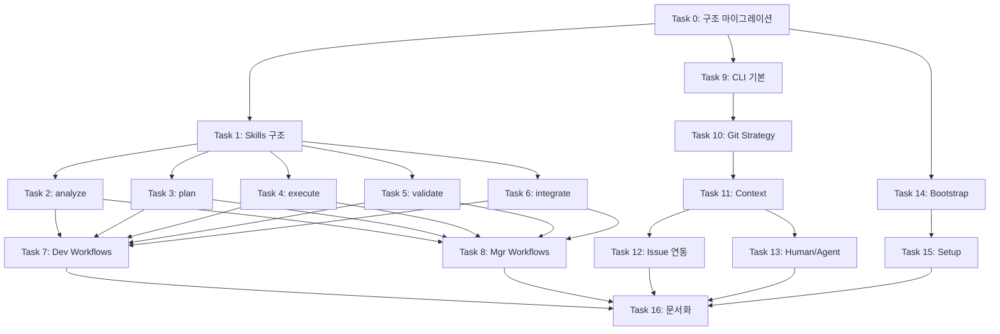

# Plan: Agent Workflow System

## Design

[design/workflow-expansion-brainstorming.md](../design/workflow-expansion-brainstorming.md)

## Requirements Checklist

이 Plan을 작성하기 전에 반드시 아래 요구사항이 명확해야 합니다.

### Core Requirements

- [x] CLI 구조 정의 (`agent <role> <action> <parameters>`, role 생략 가능)
- [x] Role 정의 (Developer, Manager - 추후 확장 가능)
- [x] Atomic Skills 구조 (목적별 분류: analyze, plan, execute, validate, integrate)
- [x] Skill 네이밍 규칙 (동사-명사, kebab-case)
- [x] Workflow = Skill의 조합

### Workflow Requirements

- [x] Developer workflows: feature, bug-fix, hotfix, refactor
- [x] Manager workflows: initiative, epic, task-assignment, monitoring, approval
- [x] Human vs Agent 수행 구분
- [x] 동적 workflow 적용 규칙 (skip, retry, human intervention)

### Git Strategy & Context Requirements

- [x] **Hybrid Mode 지원** (사용자 선택)
  - **Interactive Mode (기본값)**: Branch 방식 - 현재 디렉터리에서 브랜치 생성/작업
  - **Detached Mode (옵션)**: Worktree 방식 - 백그라운드 작업용 별도 디렉터리
- [x] Interactive Mode에서 Try = Branch (경량화)
- [x] Detached Mode에서 병렬 Try 지원 (A/B 테스트)
- [x] `.context/` 디렉터리 - 작업 맥락 저장 (task-id별 분리)
- [x] Attempt 기록 구조 (goal, expected, actual, learnings)

### Integration Requirements

- [x] MR 생성 시 로그를 Issue에 업로드
- [x] 업로드 후 로컬 context/worktree 삭제
- [x] 프로젝트 메인 디렉터리 항상 깨끗하게 유지
- [x] JIRA/GitLab 연동 (기존 pm CLI 활용)
  - **pm CLI 위치**: `tools/pm/` (본 프로젝트에 포함)
  - **agent CLI**는 pm CLI를 내부에서 호출 (래핑)
- [x] **Issue 없는 작업(N/A) 정책**:
  - MR 생성은 정상 진행
  - `.context/` 로그는 MR description에 포함 (Issue 업로드 대신)
  - `--create-issue` 옵션으로 사후 Issue 생성 가능

### Setup Requirements

- [x] Bootstrap (시스템 레벨 설정)
- [x] Setup (프로젝트 레벨 설정)
- [x] Config template 제공
- [x] 운영체제별 패키지 설치 지원 (OSX, Ubuntu, RHEL, WSL)
- [x] **Secrets 설정 강제화**: setup/init 시 `.secrets/` 필수 검증
  - API 토큰 파일 존재 여부 확인 (atlassian-api-token, gitlab-api-token)
  - 없으면 대화형 프롬프트로 입력 유도 또는 에러 종료
  - `--skip-secrets` 옵션으로 우회 가능 (CI 환경 등)

### Deployment Model Requirements

- [x] **레포 구조 변경**: `.agent/` 내용을 루트로 이동 (레포 = 배포 단위)
- [x] **배포 방식 (하이브리드)**:
  - 전역 설치: `~/.agent` (수정 가능, 모든 프로젝트 공유)
  - 로컬 설치: `project/.agent` (프로젝트별 버전 고정)
- [x] **경로 해석 우선순위**:
  1. `.agent/` (프로젝트 로컬)
  2. `.project.yaml`의 `agent_context` 설정
  3. `$AGENT_CONTEXT_PATH` 환경변수
  4. `~/.agent` (전역 기본값)
- [x] **개발 환경**: Docker 기반 테스트 또는 전역 설치 (`~/.agent`)

### Quality Requirements

- [x] Context window 제약 고려
- [x] 유지보수 용이성 (단순한 구조)
- [x] **문서 언어 정책**: 본 템플릿 repo의 `.md` 문서는 한국어 허용 (예외)
  - 실행 코드(`.sh`, `.py` 등)와 코드 주석은 영문 유지
  - 예외 근거: `.cursorrules`의 "code/docs English only"는 **실행 코드**에 적용
  - 이 예외는 본 플랜 문서(Quality Requirements)에서 명시적으로 정의됨

### Mode-specific Cleanup Policy

- [x] **Interactive Mode (Branch)**: 작업 완료 후 MR 생성 및 `.context/{task-id}/` 정리 (Archive/Delete)
- [x] **Detached Mode (Worktree)**: MR 생성 후 로컬 worktree 전체 삭제
- [x] 프로젝트 메인 디렉터리 항상 깨끗하게 유지

---

## Overview

| Item | Value |
|------|-------|
| Purpose | 협업 환경에서 Developer/Manager가 사용할 Workflow 시스템 및 CLI |
| Scope | Skills, Workflows, CLI, Context Management, Issue Integration |
| Issue | N/A (Initial Implementation) |

---

## Design Principles

### Single Source of Truth
- **Workflow 파일 = Agent 참조 + Human 참조**
- Agent가 실행하는 Skill 순서와 사람이 따라하는 Command Flow가 동일한 문서에 정의됨
- 문서 변경 시 Agent와 Human 모두 동일하게 업데이트됨

### Composable Skills
- Workflow는 Atomic Skill의 조합
- Skill은 재사용 가능한 최소 단위
- 새 Workflow = 기존 Skill 재조합

### Git Strategy (Hybrid Mode)
- **Interactive Mode (기본값)**: "나랑 같이, 내 눈앞에서 일해"
  - 현재 디렉터리에서 브랜치 생성 (`git checkout -b`)
  - 사용자가 에이전트 작업을 지켜보거나 대기
  - 익숙한 Git 워크플로우, 파일 경로 그대로 유지
  - `.context/{task-id}/` 로 로그 분리 관리
- **Detached Mode (옵션)**: "저리 가서 혼자 조용히 해"
  - Worktree로 백그라운드 작업 (`--detached` 플래그)
  - 내 작업을 방해받지 않고 에이전트가 별도 작업
  - 병렬 Try 지원 (A/B 테스트)
- **모드 선택 기준**: 싱글 에이전트 → Interactive, 병렬 작업 → Detached

### Merge Strategy (Fast Forward + Rebase)
- **Fast Forward Merge 정책**: 선형 히스토리 유지
- **Rebase 필수 시점**:
  - MR 제출 전 base 브랜치가 변경된 경우
  - CI 실패 후 base 브랜치 최신화 필요 시
- **`agent dev sync`**: base 브랜치 최신화 + rebase 자동화
- **충돌 발생 시**: Human intervention 필요 (자동 해결 시도 후 실패 시 알림)

> **Note**: 이 정책은 **권장사항(Recommendation)**입니다.  
> 실제 강제 여부는 GitLab/GitHub 프로젝트 설정(Protected Branch, Merge Method 등)에 따라 달라집니다.  
> `.agent/config.yaml`에서 `merge_strategy: ff-only | squash | merge-commit` 으로 프로젝트별 오버라이드 가능합니다.

### Context Preservation
- `.context/` 디렉터리에 작업 맥락 기록
  - **Interactive Mode**: `project/.context/{task-id}/` (프로젝트 루트에 task별 분리)
  - **Detached Mode**: `.worktrees/{task-id}/.context/` (Worktree 내부에 단일 context)
- MR 생성 시 Issue에 업로드 후 로컬 삭제
- **Issue 없는 경우**: MR description에 로그 포함
- 영구 보관은 Issue Tracker 또는 MR에서

---

## Architecture

### Directory Structure

#### agent-context 레포 구조 (개발 환경)

```
agent-context/                        # 레포 루트 = 배포 단위 (코어)
├── skills/                           # Atomic Skills
│   ├── analyze/
│   ├── plan/
│   ├── execute/
│   ├── validate/
│   └── integrate/
├── workflows/                        # Workflow 정의
│   ├── developer/
│   └── manager/
├── tools/                            # CLI 도구
│   ├── agent/                        # 메인 CLI
│   ├── pm/                           # JIRA/GitLab API 래퍼
│   ├── lint/                         # 코드 품질 검사
│   └── bootstrap/                    # 시스템 설정
├── templates/                        # 사용자 프로젝트용 템플릿
├── coding-convention/                # 언어별 코딩 규칙
├── setup.sh                          # 설치 스크립트
├── why.md                            # 설계 철학
├── README.md
│
└── tests/                            # 단위 테스트
    ├── test_skills.sh
    └── test_cli.sh
```

#### 사용자 프로젝트 구조 (Interactive Mode - 기본값)

```
user-project/                         # 작업 디렉터리
├── .agent/                           # 로컬 설치 (선택) 또는 ~/.agent 사용
│   └── (agent-context 내용)
│
├── .context/                         # 작업 맥락 (gitignored)
│   ├── TASK-123/                     # Task별 분리
│   │   ├── try.yaml
│   │   ├── attempts/
│   │   └── summary.yaml
│   └── TASK-456/
│
├── .project.yaml                     # 프로젝트 설정 (JIRA/GitLab)
├── .cursorrules                      # 에이전트 규칙
├── configs/                          # 도구 설정
├── design/                           # 설계 문서
├── plan/                             # 계획 문서
└── src/                              # 소스 코드
```

#### 경로 해석 우선순위

```
1. .agent/                            # 프로젝트 로컬 (최우선)
2. .project.yaml → agent_context      # 설정 파일 지정
3. $AGENT_CONTEXT_PATH                # 환경변수
4. ~/.agent                           # 전역 기본값
```

#### Detached Mode (고급 옵션) - Worktree 방식

```
user-project/                         # 메인 디렉터리 (깨끗하게 유지)
├── .agent/                           # (위와 동일)
├── .worktrees/                       # Worktree 루트 (gitignored)
│   ├── TASK-123-rs256/               # Try A (백그라운드 작업)
│   │   ├── (코드)
│   │   └── .context/
│   │       ├── try.yaml
│   │       ├── attempts/
│   │       └── summary.yaml
│   └── TASK-123-hs256/               # Try B (병렬)
└── ...
```

### Skill Hierarchy

```
skills/
├── analyze/                          # [Input] 상황 파악
│   ├── parse-requirement/
│   ├── inspect-codebase/
│   ├── inspect-logs/
│   ├── evaluate-priority/            # (Mgr)
│   └── assess-status/                # (Mgr)
│
├── plan/                             # [Strategy] 전략 수립
│   ├── design-solution/
│   ├── breakdown-work/
│   ├── estimate-effort/
│   ├── schedule-timeline/            # (Mgr)
│   └── allocate-resources/           # (Mgr)
│
├── execute/                          # [Action] 실행
│   ├── write-code/
│   ├── refactor-code/
│   ├── fix-defect/
│   ├── update-documentation/
│   └── manage-issues/                # (Both)
│
├── validate/                         # [Check] 검증
│   ├── run-tests/
│   ├── check-style/
│   ├── review-code/
│   ├── analyze-impact/               # (Mgr)
│   └── verify-requirements/
│
└── integrate/                        # [Output] 통합
    ├── commit-changes/
    ├── create-merge-request/
    ├── merge-changes/
    ├── notify-stakeholders/
    └── publish-report/               # (Mgr)
```

---

## Tasks

### Task 0: 레포 구조 마이그레이션 (Phase 0)

**Deps**: None (최우선 실행)

**Work**:
- [x] `.agent/` 내용을 루트로 이동
- [x] `setup.sh` 수정 (전역/로컬 설치 지원)
- [x] 경로 해석 로직 추가 (`resolve_agent_context()`)
- [x] `.gitignore` 업데이트
- [x] 문서 업데이트 (README.md, why.md)

**Files**:
- 루트 디렉터리 전체 재구성
- `setup.sh`

**Done when**:
- 레포 루트 = 배포 단위 (skills, workflows, tools가 루트에 위치)
- Docker 기반 테스트 또는 전역 설치로 테스트 가능
- `./setup.sh --global && agent --version` 동작

---

### Task 1: Atomic Skills 구조 설계

**Deps**: Task 0

**Work**:
- [ ] Skills 디렉터리 구조 재설계
- [ ] 기존 skills → 새 구조 마이그레이션 매핑 작성
- [ ] Skill YAML frontmatter 스키마 정의
- [ ] Skill template 작성 (`_template/SKILL.md` 업데이트)

**Files**:
- `skills/` (전체 구조 변경)
- `skills/_template/SKILL.md`

**Done when**: 
- 5개 카테고리(analyze, plan, execute, validate, integrate) 생성됨
- 기존 skills가 새 구조로 마이그레이션됨
- **호환성 기준**:
  - 기존 경로 → 새 경로 매핑 테이블 문서화 (`skills/MIGRATION.md`)
  - Deprecation 정책 명시 (구 경로 참조 시 warning 또는 redirect)

---

### Task 2: Skill 상세 구현 (analyze)

**Deps**: Task 1

**Work**:
- [ ] `analyze/parse-requirement/SKILL.md`
- [ ] `analyze/inspect-codebase/SKILL.md`
- [ ] `analyze/inspect-logs/SKILL.md`
- [ ] `analyze/evaluate-priority/SKILL.md` (Manager)
- [ ] `analyze/assess-status/SKILL.md` (Manager)

**Files**:
- `skills/analyze/*`

**Done when**: 5개 analyze skills 완성

---

### Task 3: Skill 상세 구현 (plan)

**Deps**: Task 1

**Work**:
- [ ] `plan/design-solution/SKILL.md`
- [ ] `plan/breakdown-work/SKILL.md`
- [ ] `plan/estimate-effort/SKILL.md`
- [ ] `plan/schedule-timeline/SKILL.md` (Manager)
- [ ] `plan/allocate-resources/SKILL.md` (Manager)

**Files**:
- `skills/planning/*`

**Done when**: 5개 plan skills 완성

---

### Task 4: Skill 상세 구현 (execute)

**Deps**: Task 1

**Work**:
- [ ] `execute/write-code/SKILL.md`
- [ ] `execute/refactor-code/SKILL.md`
- [ ] `execute/fix-defect/SKILL.md`
- [ ] `execute/update-documentation/SKILL.md`
- [ ] `execute/manage-issues/SKILL.md`

**Files**:
- `skills/execute/*`

**Done when**: 5개 execute skills 완성

---

### Task 5: Skill 상세 구현 (validate)

**Deps**: Task 1

**Work**:
- [ ] `validate/run-tests/SKILL.md`
- [ ] `validate/check-style/SKILL.md`
- [ ] `validate/review-code/SKILL.md`
- [ ] `validate/analyze-impact/SKILL.md` (Manager)
- [ ] `validate/verify-requirements/SKILL.md`

**Files**:
- `skills/validate/*`

**Done when**: 5개 validate skills 완성

---

### Task 6: Skill 상세 구현 (integrate)

**Deps**: Task 1

**Work**:
- [ ] `integrate/commit-changes/SKILL.md`
- [ ] `integrate/create-merge-request/SKILL.md`
- [ ] `integrate/merge-changes/SKILL.md`
- [ ] `integrate/notify-stakeholders/SKILL.md`
- [ ] `integrate/publish-report/SKILL.md` (Manager)

**Files**:
- `skills/integrate/*`

**Done when**: 5개 integrate skills 완성

---

### Task 7: Developer Workflows 재설계

**Deps**: Task 2, 3, 4, 5, 6

**Work**:
- [ ] Workflow 파일 템플릿 정의 (Human + Agent 통합)
- [ ] `workflows/developer/feature.md` 재작성
- [ ] `workflows/developer/bug-fix.md` 재작성
- [ ] `workflows/developer/hotfix.md` 재작성
- [ ] `workflows/developer/refactor.md` 재작성
- [ ] Workflow YAML frontmatter 스키마 정의

**Files**:
- `workflows/_template/WORKFLOW.md`
- `workflows/developer/*`
- `workflows/` (기존 파일 이동)

**Workflow File Structure**:
```yaml
---
name: feature
description: Feature development workflow
role: developer
skills:
  - analyze/parse-requirement
  - plan/design-solution
  - execute/write-code
  - validate/run-tests
  - integrate/commit-changes
---

# Feature Development

## When to Use
- (사용 시점)

## Command Flow

Agent와 사람이 동일하게 참조하는 명령어 순서입니다.

### Step 1: 작업 시작
\`\`\`bash
agent dev start <task-id>
\`\`\`
- Worktree 생성
- JIRA 상태 변경: TODO → In Progress
- .context/ 초기화

**Skills**: (없음 - CLI 직접 실행)

### Step 2: 요구사항 분석 (Optional)
\`\`\`bash
agent dev analyze
\`\`\`
- 요구사항 명확화
- 질문 생성 및 확인

**Skills**: analyze/parse-requirement
**Output**: design/requirements/<task-id>.md

### Step 3: 설계 (Optional)
\`\`\`bash
agent dev design
\`\`\`
...

## Quality Gates
...

## Notes
...
```

**Done when**: 
- 4개 developer workflows가 새 skill 구조 사용
- 각 workflow에 Human Command Flow 포함
- Agent와 사람이 동일한 문서 참조 가능

---

### Task 8: Manager Workflows 구현

**Deps**: Task 2, 3, 4, 5, 6

**Work**:
- [ ] `workflows/manager/initiative.md` (Human Command Flow 포함)
- [ ] `workflows/manager/epic.md` (Human Command Flow 포함)
- [ ] `workflows/manager/task-assignment.md` (Human Command Flow 포함)
- [ ] `workflows/manager/monitoring.md` (Human Command Flow 포함)
- [ ] `workflows/manager/approval.md` (Human Command Flow 포함)

**Files**:
- `workflows/manager/*`

**Workflow File Structure**: Task 7과 동일한 템플릿 사용

**Example (approval.md)**:
```yaml
---
name: approval
description: MR review and approval workflow
role: manager
skills:
  - analyze/parse-requirement
  - validate/review-code
  - integrate/notify-stakeholders
---

# MR Approval

## When to Use
- 개발자가 MR 생성 후
- 코드 품질 검증 필요 시

## Command Flow

### Step 1: 대기 중인 MR 확인
\`\`\`bash
agent mgr pending
\`\`\`
- 리뷰 대기 MR 목록 표시

**Skills**: (없음 - GitLab API 조회)

### Step 2: MR 상세 리뷰
\`\`\`bash
agent mgr review <mr-id>
\`\`\`
- CI 상태 확인
- 변경사항 분석
- 메트릭 표시

**Skills**: analyze/parse-requirement, validate/review-code

### Step 3: 승인 또는 피드백
\`\`\`bash
# 승인
agent mgr approve <mr-id>

# 또는 피드백 요청
agent mgr review <mr-id> --comment "message"
\`\`\`

**Skills**: integrate/notify-stakeholders

## Quality Gates
...
```

**Done when**: 
- 5개 manager workflows 완성
- 각 workflow에 Human Command Flow 포함
- Agent와 사람이 동일한 문서 참조 가능

---

### Task 9: Agent CLI 기본 구조

**Deps**: None (병렬 진행 가능)

**Work**:
- [ ] CLI entry point (`bin/agent`)
- [ ] Command parser (role, action, parameters)
- [ ] Role 자동 추론 로직
- [ ] Help 시스템

**Files**:
- `tools/agent/bin/agent`
- `tools/agent/lib/parser.sh`
- `tools/agent/lib/roles.sh`

**Done when**: `agent dev start TASK-123` 파싱 가능

---

### Task 10: Git Strategy (Branch/Worktree Support)

**Deps**: Task 9

**Work**:
- [ ] **Interactive Mode (기본값)**
  - [ ] 브랜치 생성 (`agent dev start` → `git checkout -b`)
  - [ ] 작업 목록 (`agent dev list` → 활성 브랜치 + `.context/` 상태)
  - [ ] 브랜치 전환 (`agent dev switch` → `git checkout`)
  - [ ] 작업 정리 (`agent dev cleanup` → 브랜치 삭제 + `.context/` 정리)
- [ ] **Detached Mode (고급 옵션)**
  - [ ] Worktree 생성 (`agent dev start --detached`)
  - [ ] Worktree 목록/전환/삭제
  - [ ] Try 지원 (`agent dev start --detached --try="name"`)
  - [ ] Stale worktree 자동 감지 및 정리
- [ ] **Rebase Support (Fast Forward Merge)**
  - [ ] Base 브랜치 동기화 (`agent dev sync` → `git fetch` + `git rebase`)
  - [ ] Rebase 전 상태 저장 (충돌 발생 시 복구 가능)
  - [ ] 충돌 감지 및 Human intervention 요청
  - [ ] `--abort` 옵션 (rebase 중단 및 이전 상태 복구)
  - [ ] Submit 전 자동 sync 옵션 (`agent dev submit --sync`)
- [ ] 모드 자동 감지 (현재 디렉터리가 worktree인지 확인)

**Files**:
- `tools/agent/lib/git-strategy.sh` (구 worktree.sh 대체)
- `tools/agent/lib/branch.sh`
- `tools/agent/lib/worktree.sh`
- `tools/agent/lib/rebase.sh`

**Done when**: 
- Interactive Mode: 브랜치 생성/전환/삭제 동작
- Detached Mode: Worktree 생성/삭제 동작
- Rebase: `agent dev sync`로 base 브랜치 최신화 동작
- `--detached` 플래그로 모드 전환 가능

---

### Task 11: Context 관리 기능

**Deps**: Task 10

**Work**:
- [ ] `.context/` 디렉터리 구조 생성
  - Interactive Mode: `.context/{task-id}/` (프로젝트 루트)
  - Detached Mode: `.worktrees/{task-id}/.context/` (Worktree 내부)
- [ ] `try.yaml` 템플릿 및 생성 로직
- [ ] Attempt 기록 (`attempt-NNN.yaml`)
- [ ] Summary 생성 로직
- [ ] **Rolling Summary 기능**: 중간 요약 갱신 (Context Window 초과 방지)
  - `agent dev check` 또는 `commit` 시 summary.yaml 갱신
  - 이전 attempt 로그 아카이빙 옵션

**Files**:
- `tools/agent/lib/context.sh`
- `tools/agent/resources/try.yaml`
- `tools/agent/resources/attempt.yaml`

**Done when**: 작업 시 `.context/` 자동 생성 및 기록 (두 모드 모두 지원)

---

### Task 12: Issue 연동 및 로그 업로드

**Deps**: Task 11

**Work**:
- [ ] Context → Markdown 변환
- [ ] JIRA comment 업로드 (pm CLI 활용)
- [ ] GitLab issue note 업로드
- [ ] 업로드 후 worktree 정리
- [ ] **Issue N/A 케이스 처리**:
  - Issue 없으면 MR description에 로그 포함
  - `--create-issue` 옵션으로 사후 Issue 생성

**Files**:
- `tools/agent/lib/upload.sh`
- `tools/agent/lib/markdown.sh`

**Done when**: 
- Issue 있음: `agent dev submit` 시 Issue에 로그 업로드됨
- Issue 없음: MR description에 로그 포함됨

---

### Task 13: Human/Agent 실행 모델

**Deps**: Task 11

**Work**:
- [ ] Executor type 정의 (human, agent, hybrid)
- [ ] Skill별 실행 모드 명시
- [ ] Human 대기 상태 처리
- [ ] 동적 workflow 규칙 엔진
- [ ] **Permission 모델 구현**:
  - [ ] Command별 권한 레벨 정의 (`human_only`, `agent_allowed`)
  - [ ] 기본값: `mgr approve`, `mgr merge` → `human_only` (사람만 실행)
  - [ ] 기본값: `dev code`, `dev check` → `agent_allowed`
  - [ ] `.agent/config.yaml`에서 프로젝트별 오버라이드 가능

**Files**:
- `tools/agent/lib/executor.sh`
- `tools/agent/lib/permissions.sh`
- `config.yaml` (execution rules, permissions)

**Done when**: 
- Human intervention 필요 시 대기 및 알림
- `human_only` 명령어는 에이전트 실행 시 거부됨

---

### Task 14: Bootstrap 스크립트

**Deps**: None (병렬 진행 가능)

**Work**:
- [ ] OS 감지 로직
- [ ] macOS 설치 스크립트 (Homebrew)
- [ ] Ubuntu/Debian 설치 스크립트 (apt)
- [ ] RHEL/Fedora 설치 스크립트 (dnf)
- [ ] WSL 지원

**Files**:
- `tools/bootstrap/install.sh`
- `tools/bootstrap/lib/detect_os.sh`
- `tools/bootstrap/lib/macos.sh`
- `tools/bootstrap/lib/debian.sh`
- `tools/bootstrap/lib/fedora.sh`

**Done when**: One-liner로 시스템 설정 가능

---

### Task 15: Project Setup 및 Config

**Deps**: Task 14

**Work**:
- [ ] `agent init` 명령 구현
- [ ] Config template (JIRA/GitLab/GitHub)
- [ ] 대화형 설정 마법사
- [ ] Git hooks 설치 자동화
- [ ] **Secrets 설정 강제화**
  - [ ] `.secrets/` 디렉터리 검증 로직
  - [ ] 필수 토큰 파일 존재 확인 (atlassian-api-token, gitlab-api-token)
  - [ ] 대화형 입력 프롬프트 (파일 없을 시)
  - [ ] `--skip-secrets` 옵션 (CI 환경용)

**Files**:
- `tools/agent/lib/init.sh`
- `tools/agent/lib/secrets.sh`
- `config.template.yaml`

**Done when**: `agent init`으로 프로젝트 설정 완료, secrets 없으면 에러

---

### Task 16: 문서화

**Deps**: All above

**Work**:
- [ ] Skills README 업데이트
- [ ] Workflows README 업데이트
- [ ] CLI 사용법 문서
- [ ] 예제 시나리오 문서

**Files**:
- `skills/README.md`
- `workflows/README.md`
- `tools/agent/README.md`

**Done when**: 새 구조에 맞는 문서 완성

---

## Dependencies



---

## Testing

### Unit Tests
- CLI argument parsing
- Worktree 생성/삭제
- Context YAML 생성
- Markdown 변환

### Integration Tests
- 전체 workflow 시나리오 (feature development)
- JIRA/GitLab 연동
- 병렬 try 시나리오
- Rebase 시나리오 (충돌 없음 / 충돌 발생 → Human intervention)

### Manual Tests
- Human intervention 시나리오
- OS별 bootstrap 테스트

---

## Risks

| Risk | Prob | Impact | Mitigation |
|------|------|--------|------------|
| 기존 skills 마이그레이션 복잡 | Med | High | 단계별 마이그레이션, 호환성 유지 |
| Context window 초과 | Med | Med | Rolling Summary (Task 11), Skill 단위 로드 |
| OS별 호환성 문제 | Med | Med | 각 OS에서 테스트, fallback 제공 |
| Human/Agent 전환 복잡 | Low | Med | 명확한 상태 머신 설계 |
| ~~Worktree 복잡도~~ | ~~Med~~ | ~~Med~~ | ~~Hybrid Mode: 기본 Branch, 옵션 Worktree~~ **해결됨** |
| Detached Mode worktree 잔류 | Low | Low | `cleanup --auto`로 stale worktree 자동 감지/정리 |
| Rebase 충돌 처리 | Med | Med | 충돌 시 Human intervention, `--abort`로 복구 가능 |

---

## Rollback

1. Phase 0 전에 브랜치 생성 (`git checkout -b backup/pre-migration`)
2. 문제 발생 시 해당 브랜치로 복원
3. 마이그레이션은 git으로 추적되므로 `git revert`로 롤백 가능

---

## Command Flow by Workflow (Reference)

> **Note**: 이 섹션은 Plan 문서의 참조용 예시입니다.
> **실제 Command Flow는 각 Workflow 파일에 정의됩니다.**
> - `.agent/workflows/developer/*.md`
> - `.agent/workflows/manager/*.md`
> 
> Agent와 사람 모두 동일한 Workflow 파일을 참조합니다. (Single Source of Truth)

사람이 직접 CLI를 사용할 때의 명령어 흐름 예시입니다.

### Developer Workflows

#### Feature Development (Interactive Mode - 기본)

```bash
# 1. 작업 시작 (Branch 생성)
agent dev start TASK-123
# → feat/TASK-123-description 브랜치 생성 (git checkout -b)
# → .context/TASK-123/ 초기화
# → JIRA: TODO → In Progress

# 2. (Optional) 요구사항 분석이 필요한 경우
agent dev analyze
# → 요구사항 명확화 질문
# → design/requirements/TASK-123.md 생성

# 3. (Optional) 설계가 필요한 경우
agent dev design
# → 솔루션 설계
# → design/solutions/TASK-123.md 생성

# 4. (Optional) 작업 분해가 필요한 경우
agent dev plan
# → Task 분해
# → plan/tasks/TASK-123.md 생성

# 5. 코드 작성 (TDD)
agent dev code
# → 테스트 작성 → 구현
# → .context/attempts/attempt-001.yaml 기록

# 6. 품질 검증
agent dev check
# → Lint + Test + Self-review
# → 결과 기록

# 7. 변경사항 커밋
agent dev commit "feat(scope): description"
# → git add + commit
# → attempt에 commit sha 기록

# 8. (반복) 추가 작업이 있으면 5-7 반복
agent dev code
agent dev check
agent dev commit "feat(scope): another change"

# 9. 최종 검증
agent dev verify
# → 요구사항 충족 확인
# → 전체 테스트 통과 확인

# 10. Base 브랜치 동기화 (Fast Forward Merge 준비)
agent dev sync
# → git fetch origin main
# → git rebase origin/main
# → 충돌 시 Human intervention 요청
# → 충돌 해결 후 `agent dev sync --continue`

# 11. 작업 제출
agent dev submit
# → git push
# → MR 생성
# → .context/TASK-123/ 로그 처리:
#    - Issue 있음: Issue에 업로드
#    - Issue 없음: MR description에 포함
# → .context/TASK-123/ 삭제 (아카이빙 후)
# → JIRA: In Progress → In Review (Issue 있을 때)
```

#### Bug Fix (Interactive Mode - 기본)

```bash
# 1. 작업 시작
agent dev start BUG-456
# → fix/BUG-456-description 브랜치 생성
# → .context/BUG-456/ 초기화

# 2. 로그 분석 (버그 원인 파악)
agent dev analyze --logs
# → 에러 로그 분석
# → 원인 파악

# 3. 버그 수정 (테스트 먼저)
agent dev code
# → 실패하는 테스트 작성 (버그 재현)
# → 수정
# → 테스트 통과

# 4. 품질 검증
agent dev check

# 5. 커밋
agent dev commit "fix(scope): description"

# 6. 제출
agent dev submit
```

#### Hotfix (긴급 수정)

```bash
# 방법 A: Interactive Mode (기본) - 현재 작업 stash 후 진행
agent dev start HOTFIX-789 --from=main
# → 현재 변경사항 stash
# → hotfix/HOTFIX-789-description 브랜치 (main에서 분기)
# → .context/HOTFIX-789/ 초기화

# 방법 B: Detached Mode - 현재 작업 그대로 두고 별도 진행
agent dev start HOTFIX-789 --from=main --detached
# → .worktrees/HOTFIX-789/ 생성 (main에서 분기)
# → 현재 작업은 그대로 유지

# 2. 빠른 수정
agent dev code --fast
# → 최소한의 수정

# 3. 핵심 테스트만 실행
agent dev check --critical
# → 핵심 테스트만

# 4. 커밋
agent dev commit "fix: urgent description"

# 5. 긴급 제출
agent dev submit --urgent
# → MR 생성 (urgent label)
# → 즉시 알림

# 6. (Merge 후) 정리
agent dev cleanup HOTFIX-789
```

#### Refactoring

```bash
# 1. 작업 시작
agent dev start REFACTOR-101

# 2. 리팩토링 계획
agent dev plan
# → 리팩토링 범위 정의
# → 단계별 계획

# 3. 기존 테스트 확인
agent dev check --tests-only
# → 테스트 커버리지 확인
# → 필요시 테스트 추가

# 4. 점진적 리팩토링 (작은 단위)
agent dev code
agent dev check
agent dev commit "refactor(scope): extract method"

agent dev code
agent dev check
agent dev commit "refactor(scope): rename variable"

# (반복...)

# 5. 최종 검증
agent dev verify
# → 동작 변경 없음 확인

# 6. 제출
agent dev submit
```

#### Parallel Try (A/B 테스트) - Detached Mode 전용

> **Note**: 병렬 Try는 **Detached Mode**에서만 지원됩니다.
> Interactive Mode에서는 하나의 브랜치에서 순차적으로 작업합니다.

```bash
# 1. 첫 번째 방법 시작 (Detached Mode)
agent dev start TASK-123 --detached --try="jwt-rs256"
# → .worktrees/TASK-123-jwt-rs256/

# 2. 두 번째 방법 시작 (병렬)
agent dev start TASK-123 --detached --try="jwt-hs256"
# → .worktrees/TASK-123-jwt-hs256/

# 3. Try 목록 확인
agent dev list TASK-123
# TASK-123:
#   - TASK-123-jwt-rs256 (in_progress, detached)
#   - TASK-123-jwt-hs256 (in_progress, detached)

# 4. Try 전환 (Worktree 간 이동)
agent dev switch TASK-123-jwt-rs256
# (작업)
agent dev switch TASK-123-jwt-hs256
# (작업)

# 5. 비교
agent dev compare TASK-123
# → 두 Try 결과 비교 표시

# 6. 하나 선택하여 제출
agent dev submit TASK-123-jwt-rs256
# → 선택된 Try → MR
# → 모든 Try 로그 처리:
#    - Issue 있음: Issue에 업로드
#    - Issue 없음: MR description에 포함
# → 모든 Worktree 삭제
```

---

### Manager Workflows

#### Initiative Planning

```bash
# 1. Initiative 정의
agent mgr initiative create "Q1 Performance Optimization"
# → 대화형으로 목표, 범위 정의
# → design/initiatives/q1-performance.md 생성

# 2. Epic 분해
agent mgr epic create "Phase 1: Profiling" --initiative=INIT-1
agent mgr epic create "Phase 2: Database" --initiative=INIT-1
agent mgr epic create "Phase 3: Caching" --initiative=INIT-1
# → JIRA Epic 생성
# → GitLab Milestone 생성

# 3. 첫 Epic의 Task 생성
agent mgr task create "Profile API endpoints" --epic=EPIC-1
agent mgr task create "Analyze slow queries" --epic=EPIC-1
# → JIRA Task 생성
# → GitLab Issue 생성

# 4. 개발자 할당
agent mgr assign TASK-1 --to=@john
agent mgr assign TASK-2 --to=@jane
# → 개발자에게 알림
```

#### Task Assignment

```bash
# 1. 새 요청 확인
agent mgr inbox
# → 할당 대기 중인 이슈 목록

# 2. 우선순위 평가
agent mgr evaluate TASK-123
# → 긴급도/중요도 분석
# → 추천 우선순위 제시

# 3. 작업 분해 (필요시)
agent mgr breakdown TASK-123
# → 하위 Task 생성

# 4. 할당
agent mgr assign TASK-123 --to=@john --priority=P1
# → JIRA 할당
# → 개발자 알림
```

#### Progress Monitoring

```bash
# 1. 상태 확인
agent mgr status EPIC-1
# → 진행률 표시
# → 각 Task 상태
# → 블로커 표시

# 2. 전체 Initiative 상태
agent mgr status INIT-1 --summary
# → Epic별 진행률
# → 전체 진행률

# 3. 지연 감지
agent mgr detect-delays EPIC-1
# → 지연된 Task 목록
# → 예상 영향 분석

# 4. 일정 조정 (필요시)
agent mgr adjust EPIC-1 --deadline="2026-02-15"
# → 일정 재계산
# → 팀 알림
```

#### MR Approval

```bash
# 1. 대기 중인 MR 확인
agent mgr pending
# → 리뷰 대기 MR 목록

# 2. MR 상세 리뷰
agent mgr review MR-456
# → CI 상태 표시
# → 변경사항 요약
# → 메트릭 (coverage, complexity)
# → 자동 검사 결과

# 3. 승인
agent mgr approve MR-456
# → GitLab MR 승인
# → JIRA 상태 업데이트

# 또는 피드백 요청
agent mgr review MR-456 --comment "Please fix complexity"
# → 코멘트 추가
# → 개발자 알림
```

#### Reporting

```bash
# 1. 일일 리포트 확인 (자동 생성됨)
agent mgr report daily
# → 어제 완료된 작업
# → 진행 중인 작업
# → 블로커

# 2. 주간 리포트 생성
agent mgr report weekly --epic=EPIC-1
# → 주간 진행 상황
# → 다음 주 계획

# 3. 리포트 발행
agent mgr report weekly --publish
# → Confluence 업로드
# → Slack 공유
```

---

### Common Commands

```bash
# 도움말
agent help
agent dev help
agent mgr help

# 현재 상태
agent status
# → 현재 worktree 정보
# → 진행 중인 작업

# 설정
agent config show
agent config set jira.project_key PROJ

# 초기화 (프로젝트 최초 설정)
agent init
# → 대화형 설정
# → .agent/config.yaml 생성
# → Git hooks 설치
```

---

### Command Quick Reference

#### Developer

| Command | Description |
|---------|-------------|
| `agent dev start <task>` | 작업 시작 (Interactive, 브랜치 생성) |
| `agent dev start <task> --detached` | 작업 시작 (Detached, worktree 생성) |
| `agent dev start <task> --detached --try="name"` | 특정 방법으로 시작 (병렬 Try) |
| `agent dev list` | 현재 작업 목록 (브랜치 + worktree) |
| `agent dev switch <branch/worktree>` | 작업 전환 |
| `agent dev analyze` | 요구사항/로그 분석 |
| `agent dev design` | 솔루션 설계 |
| `agent dev plan` | 작업 분해 |
| `agent dev code` | 코드 작성 (TDD) |
| `agent dev check` | 품질 검증 (lint, test, review) |
| `agent dev commit <msg>` | 변경사항 커밋 |
| `agent dev sync` | Base 브랜치 동기화 (rebase) |
| `agent dev sync --continue` | 충돌 해결 후 rebase 계속 |
| `agent dev sync --abort` | Rebase 중단, 이전 상태 복구 |
| `agent dev verify` | 요구사항 충족 확인 |
| `agent dev submit` | MR 생성 및 정리 |
| `agent dev submit --sync` | 동기화 후 MR 생성 (sync + submit) |
| `agent dev compare <task>` | Try 비교 (Detached Mode) |
| `agent dev cleanup <task>` | 작업 정리 (브랜치/worktree 삭제) |

#### Manager

| Command | Description |
|---------|-------------|
| `agent mgr initiative create <title>` | Initiative 생성 |
| `agent mgr epic create <title>` | Epic 생성 |
| `agent mgr task create <title>` | Task 생성 |
| `agent mgr assign <task> --to=<user>` | Task 할당 |
| `agent mgr status <id>` | 진행 상황 확인 |
| `agent mgr pending` | 대기 중인 MR 목록 |
| `agent mgr review <mr>` | MR 리뷰 |
| `agent mgr approve <mr>` | MR 승인 |
| `agent mgr report <period>` | 리포트 생성 |
| `agent mgr inbox` | 할당 대기 이슈 |
| `agent mgr evaluate <task>` | 우선순위 평가 |
| `agent mgr breakdown <task>` | 작업 분해 |
| `agent mgr detect-delays <epic>` | 지연 감지 |
| `agent mgr adjust <epic>` | 일정 조정 |

---

## Implementation Phases

### Phase 0: 구조 마이그레이션
- Task 0
- 레포 구조 변경 (`.agent/` → 루트)
- 개발 환경 설정 (Docker 기반 테스트)

**Phase 0 성공 기준**:
- [x] 레포 루트에 `skills/`, `workflows/`, `tools/` 위치
- [x] Docker 또는 전역 설치로 테스트 가능
- [x] `./setup.sh --global` 실행 가능
- [x] 기존 테스트 통과

### Phase 1: Core (MVP)
- Task 1, 9, 10, 11
- 기본 CLI + Git Strategy (Branch/Worktree) + Context

**MVP Demo Scenario (Interactive Mode - 기본)**:
```bash
# 1. 작업 시작
agent dev start TASK-123
# → feat/TASK-123 브랜치 생성
# → .context/TASK-123/try.yaml 생성

# 2. 상태 확인
agent status
# → 현재 브랜치, context 정보 표시

# 3. 제출 (Issue N/A)
agent dev submit
# → MR 생성, MR description에 .context/ 로그 포함
# → .context/TASK-123/ 정리
```

**MVP Demo Scenario (Detached Mode - 고급)**:
```bash
# 1. 작업 시작 (백그라운드)
agent dev start TASK-123 --detached --try=approach-a
# → .worktrees/TASK-123-approach-a/ 생성
# → .worktrees/TASK-123-approach-a/.context/try.yaml 생성

# 2. 상태 확인
agent status
# → 현재 worktree, try 정보 표시

# 3. 제출
agent dev submit
# → MR 생성, worktree 삭제
```

**MVP 성공 기준**:
- [ ] Interactive Mode: 브랜치 생성 → 작업 → MR 생성 end-to-end 동작
- [ ] Detached Mode: Worktree 생성 → 작업 → MR 생성 → 정리 동작
- [ ] `agent dev list`로 활성 작업 목록 확인 가능 (브랜치 + worktree)
- [ ] `agent dev cleanup`으로 수동 정리 가능
- [ ] `agent dev submit` 시 MR 생성 확인 (pm CLI의 GitLab API 호출 경로 검증)

### Phase 2: Skills & Workflows
- Task 2, 3, 4, 5, 6, 7, 8
- Atomic Skills + Developer/Manager Workflows

### Phase 3: Integration
- Task 12, 13
- Issue 연동 + Human/Agent 모델

### Phase 4: Setup & Docs
- Task 14, 15, 16
- Bootstrap + 문서화

---

## Checklist

### Requirements
- [x] 모든 요구사항 명확
- [x] 기존 구조와의 호환성 고려
- [x] 배포 모델 결정 (전역 + 로컬 하이브리드)
- [x] 개발 환경 설계 (Docker 기반 테스트)
- [ ] 이해관계자 승인

### Implementation
- [ ] Phase 0 완료 (구조 마이그레이션)
- [ ] Phase 1 완료 (Core MVP)
- [ ] Phase 2 완료 (Skills & Workflows)
- [ ] Phase 3 완료 (Integration)
- [ ] Phase 4 완료 (Setup & Docs)

### Quality
- [ ] 모든 테스트 통과
- [ ] Lint 통과
- [ ] 문서 업데이트
- [ ] 코드 리뷰 완료

---

## Detailed Task Checklist (Updated: 2026-01-24)

### Task 0: 레포 구조 마이그레이션 (Phase 0) - **완료**

- [x] `.agent/` 내용을 루트로 이동
- [x] `setup.sh` 수정
- [x] 경로 해석 로직 추가
- [x] `.gitignore` 업데이트
- [x] 문서 업데이트

> **Note**: 테스트는 Docker 기반 또는 전역 설치(`~/.agent`)로 진행

---

### Task 1: Atomic Skills 구조 설계 - **완료**

- [x] Skills 디렉터리 구조 재설계 (5개 카테고리)
- [x] Skill template 작성 (`_template/SKILL.md`)

---

### Task 2-6: Skill 상세 구현 - **완료**

- [x] `analyze/` - 5개 skills
- [x] `plan/` - 5개 skills
- [x] `execute/` - 5개 skills
- [x] `validate/` - 5개 skills (+ references/)
- [x] `integrate/` - 5개 skills (+ scripts/)

---

### Task 7: Developer Workflows 재설계 - **완료**

**완료일**: 2026-01-24

- [x] `workflows/developer/` 디렉터리 생성
- [x] `feature.md` 이동 → `developer/feature.md`
- [x] `bug-fix.md` 이동 → `developer/bug-fix.md`
- [x] `hotfix.md` 이동 → `developer/hotfix.md`
- [x] `refactor.md` 이동 → `developer/refactor.md`
- [x] 루트의 기존 `*.md` 파일 제거
- [x] `workflows/README.md` 업데이트

---

### Task 8: Manager Workflows 구현 - **완료**

- [x] `workflows/manager/` 디렉터리 존재
- [x] `initiative.md` 존재
- [x] `epic.md` 존재
- [x] `task-assignment.md` 존재
- [x] `monitoring.md` 존재
- [x] `approval.md` 존재

---

### Task 9: Agent CLI 기본 구조 - **완료**

- [x] CLI entry point (`bin/agent`)
- [x] Command parser (`lib/parser.sh`)
- [x] Role 자동 추론 (`lib/roles.sh`)
- [x] Help 시스템

---

### Task 10: Git Strategy - **완료**

- [x] Interactive Mode (Branch) - `lib/branch.sh`
- [x] Detached Mode (Worktree) - `lib/git-strategy.sh`
- [x] Rebase Support - `dev_sync`

---

### Task 11: Context 관리 기능 - **완료**

- [x] `.context/` 디렉터리 구조 - `lib/context.sh`
- [x] `try.yaml` 템플릿
- [x] Attempt 기록
- [x] Summary 생성

---

### Task 12: Issue 연동 및 로그 업로드 - **완료**

- [x] Context → Markdown 변환 - `lib/markdown.sh`
- [x] JIRA comment 업로드 - `lib/upload.sh`
- [x] GitLab issue note 업로드
- [x] Issue N/A 케이스 처리

---

### Task 13: Human/Agent 실행 모델 - **완료**

- [x] Executor type 정의 - `lib/executor.sh`
- [x] Permission 모델 구현 - `lib/permissions.sh`
- [x] Human 대기 상태 처리

---

### Task 14: Bootstrap 스크립트 - **완료**

- [x] `bootstrap.sh` 존재
- [x] OS 감지 로직 (macOS, Ubuntu, RHEL)

---

### Task 15: Project Setup 및 Config - **완료**

- [x] `agent init` 명령 구현 - `lib/init.sh`
- [x] Git hooks 설치 자동화
- [x] Secrets 설정 검증

---

### Task 16: 문서화 - **완료**

**완료일**: 2026-01-24

- [x] `docs/` 디렉터리 생성 (uftrace 스타일)
- [x] CLI 명령어별 문서 생성
  - [x] `docs/agent.md` - 메인 CLI 개요
  - [x] `docs/agent-dev.md` - Developer 명령어
  - [x] `docs/agent-mgr.md` - Manager 명령어
  - [x] `docs/agent-init.md` - 초기화
- [x] `docs/README.md` - 문서 인덱스
- [x] Workflows README 업데이트

---

### Task 17: Manager CLI 실제 구현 - **완료**

**완료일**: 2026-01-24

- [x] `mgr_pending` 구현 - pm CLI 연동
- [x] `mgr_review` 구현 - MR 상세 조회 + 코멘트 추가
- [x] `mgr_approve` 구현 - MR 승인 (권한 검사 포함)
- [x] `mgr_status` 구현 - Initiative/Epic/Task 상태 조회
- [x] `tools/agent/lib/manager.sh` 생성
- [x] pm CLI 연동 테스트

---

## Completed Work Summary (2026-01-24)

| 작업 | 상태 | 비고 |
|------|------|------|
| Workflows 구조 변경 (Task 7) | **완료** | developer/, manager/ 분리 |
| Manager CLI 구현 (Task 17) | **완료** | lib/manager.sh 생성 |
| docs/ 생성 (Task 16) | **완료** | uftrace 스타일 5개 문서 |

---

**Created**: 2026-01-23 | **Author**: Agent
**Updated**: 2026-01-23 | 구조 마이그레이션 계획 추가
**Approved**: Pending
