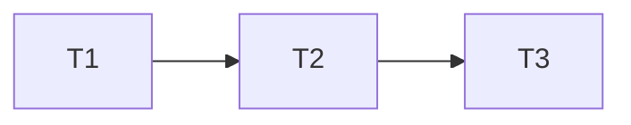

# Plan: {Feature}

## Design

[design/{feature}.md](../../design/{feature}.md)

## Overview

| Item | Value |
|------|-------|
| Purpose | {one line} |
| Scope | {components} |
| Issue | {PROJ-XXX} |

## Tasks

### Task 1: {Name}

**Deps**: None

**Work**:
- [ ] Item 1
- [ ] Item 2
- [ ] Tests

**Files**:
- `path/file1.py`
- `tests/test.py`

**Done when**: Criteria

---

### Task 2: {Name}

**Deps**: Task 1

**Work**:
- [ ] Item 1
- [ ] Item 2

**Files**:
- `path/file.py`

---

### Task 3: {Name}

**Deps**: Task 2

**Work**:
- [ ] Item 1

---

## Dependencies

## Testing

### Unit
- Case 1
- Case 2

### Integration
- Scenario 1

## Risks

| Risk | Prob | Impact | Plan |
|------|------|--------|------|
| Risk 1 | Med | High | Mitigation |

## Rollback

1. Step 1
2. Step 2

## Checklist

- [ ] All tasks done
- [ ] Tests pass
- [ ] Lint pass
- [ ] Review done
- [ ] Docs updated

---

**Created**: {date} | **Author**: {name}
**Approved**: {date}
